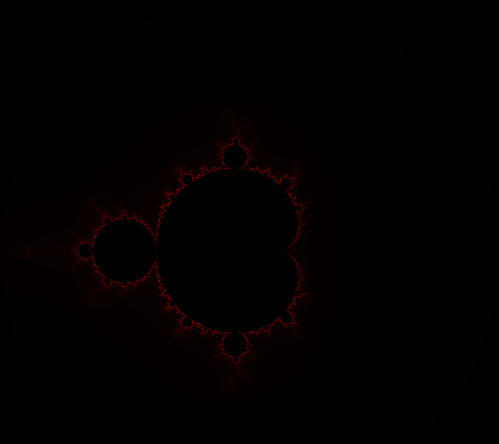
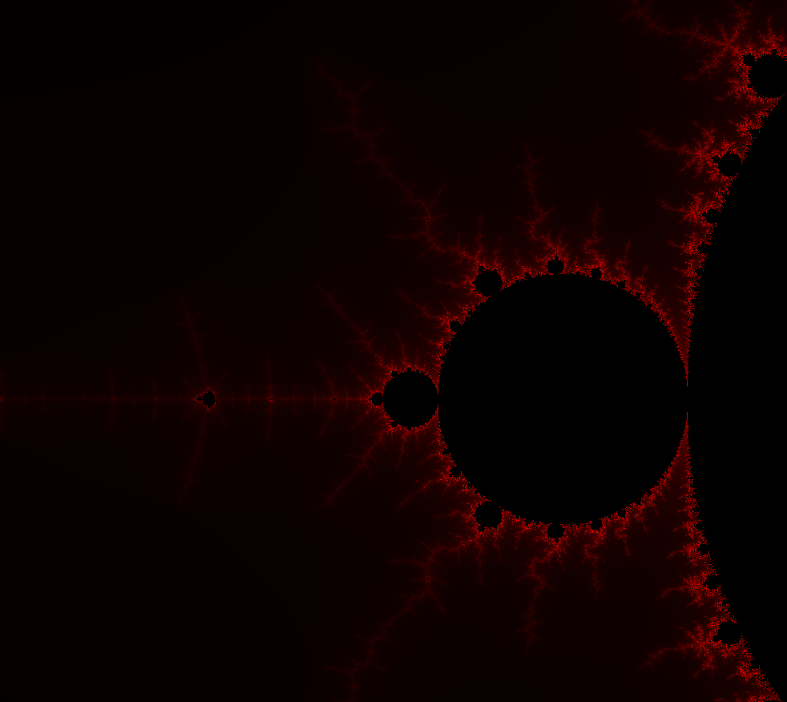
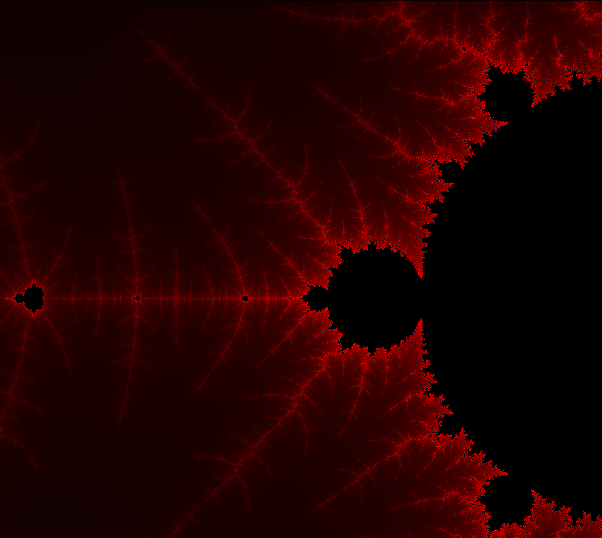

# Fractal_Mandelbrot_ARKO

Project developed for *Computer Architecture*. 

Interface was written in C++, but function responsible for generating Mandelbrot set was written in x86-64 assembler.

Program is interactive: choose resolution, zoom rate and then click at point in order to zoom that area.

Requirements:
* x86_64 architecture
* `g++`
* `nasm`
* `SDL`: version 2.0.9 (stable)

Example views:

